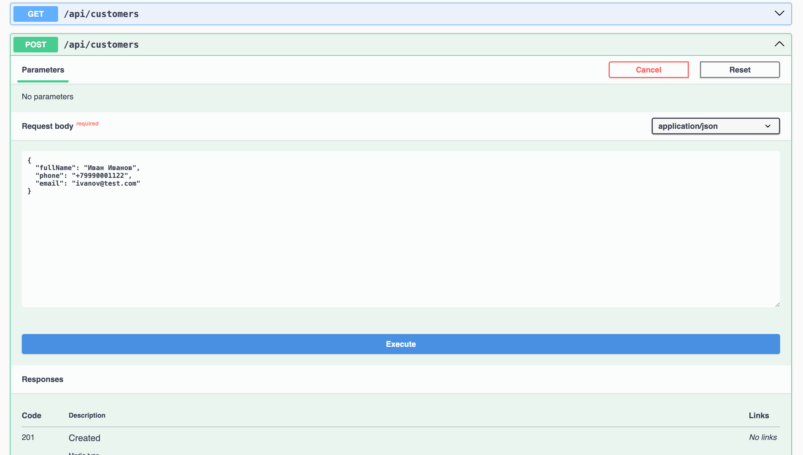
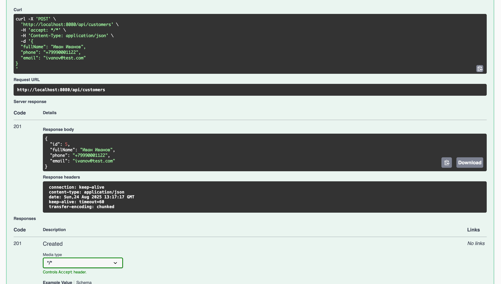
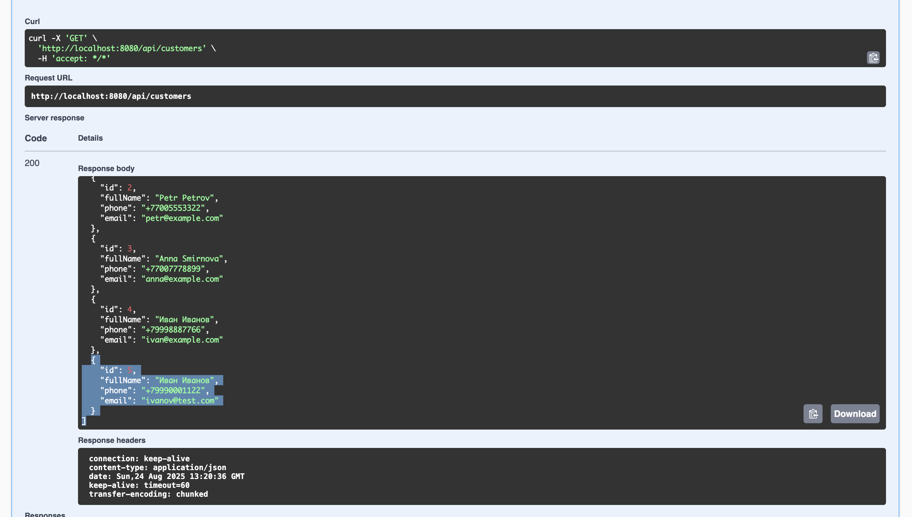
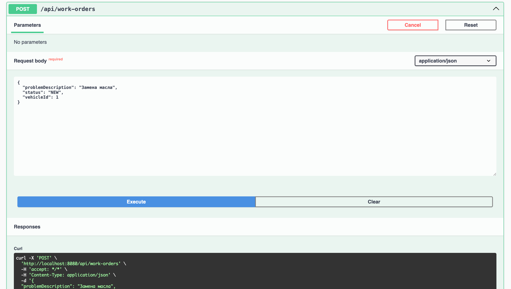
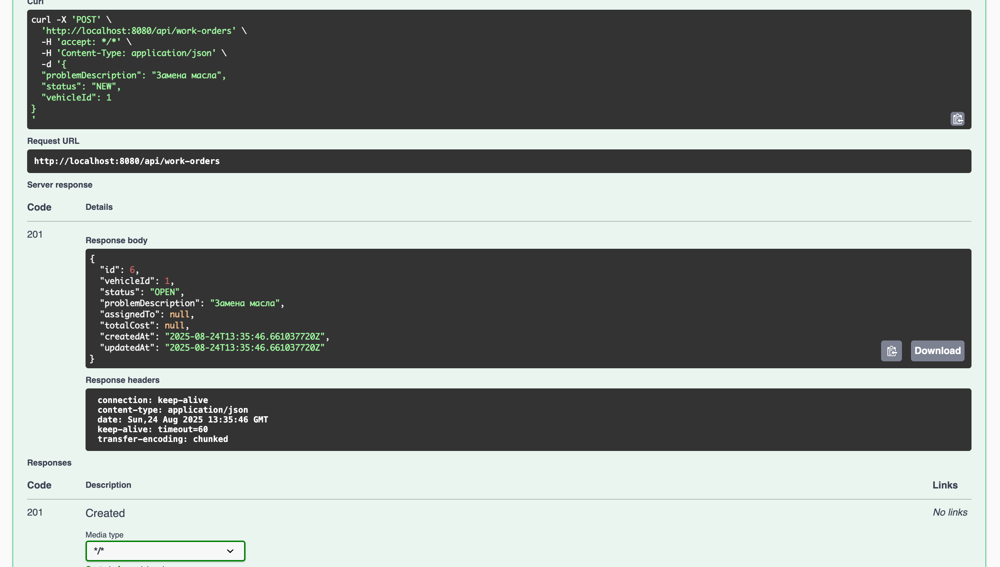
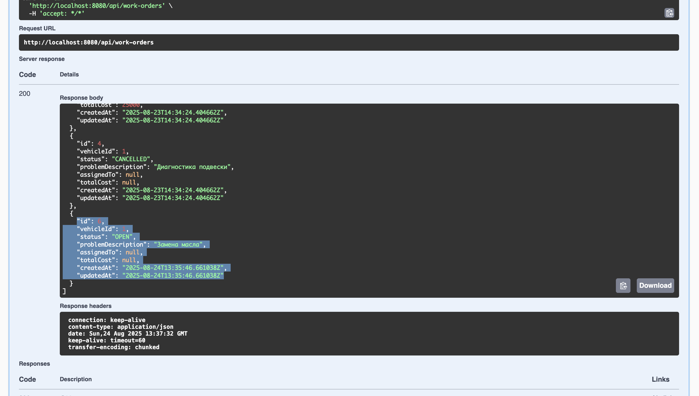
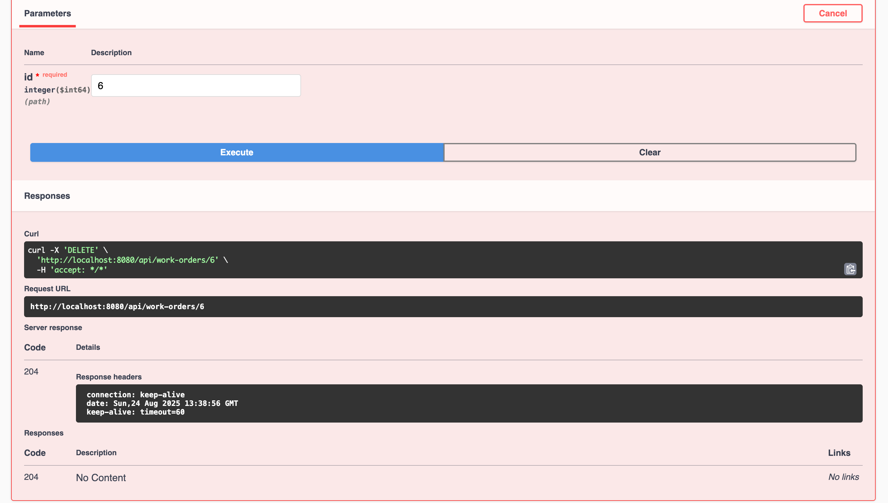
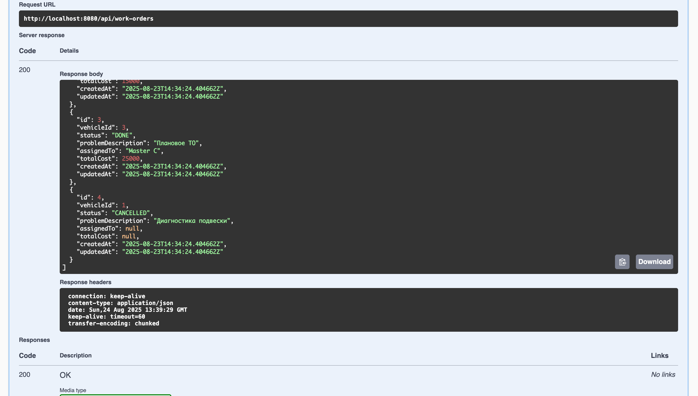

# AutoService Lite CRM

A lightweight CRM system for auto repair shops.  
Provides a REST API for managing customers and service orders.  
Built with **Java 17** and **Spring Boot 3**.

The project demonstrates clean architecture principles, usage of DTOs, database migrations with Flyway, global exception handling, PostgreSQL integration, and containerization via Docker.

---

## Table of Contents

* [Features](#features)
* [Architecture](#architecture)
* [Testing](#testing)
* [Tech Stack](#tech-stack)
* [Data Model](#data-model)
* [Database Migrations](#database-migrations)
* [Running the App](#running-the-app)

    * [Option A: Full Docker Setup](#option-a-full-docker-setup)
    * [Option B: Local App + DB in Docker](#option-b-local-app--db-in-docker)
* [REST API](#rest-api)

    * [Customers](#customers)
    * [Orders](#orders)
    * [cURL Examples](#curl-examples)
    * [Workflow Screenshots](#workflow-screenshots)
* [Future Improvements](#future-improvements)

---

## Features

* CRUD operations for customers.  
* CRUD operations for orders (linked to customers).  
* Demo data automatically loaded via Flyway migrations.  
* Swagger UI for testing and documentation.  
* PostgreSQL with strict schema control.  
* Global error handling with unified response format.  
* Docker Compose setup (application + database).  
* Basic unit and integration tests (repositories, REST controllers).

---

## Architecture

```

src/main/java/io/mitrofanovbp/autoservice/
├─ config/       # Configuration classes
├─ controller/   # REST controllers
├─ dto/          # DTOs for requests/responses
├─ exception/    # Custom exceptions + global handler
├─ model/        # JPA entities (Customer, Order)
├─ repository/   # Spring Data JPA repositories
└─ service/      # Business logic

src/test/java/io/mitrofanovbp/autoservice/
├─ CustomerRepositoryTest.java   # Repository unit test
└─ CustomerControllerTest.java   # REST API integration test

````

---

## Testing

Includes basic tests demonstrating code coverage practices:

* **Repository Unit Test** (`CustomerRepositoryTest`)  
  Verifies entity persistence and retrieval through JPA.

* **Controller Integration Test** (`CustomerControllerTest`)  
  Uses `MockMvc` to validate customer creation and list retrieval via REST API.

Run tests:
```bash
mvn test
````

---

## Tech Stack

* **Java 17**
* **Spring Boot 3** (Web, Data JPA, Validation)
* **Hibernate** (via Spring Data JPA)
* **PostgreSQL 16**
* **Flyway** (database migrations)
* **Jackson** (JSON serialization)
* **Swagger (springdoc-openapi)** (API documentation)
* **JUnit 5**, **Spring Test (MockMvc)** (testing)
* **Docker**, **Docker Compose**
* **Maven**

---

## Data Model

* `customers` — clients (`full_name`, `phone`, `email`)
* `orders` — service orders (`description`, `status`, `customer_id`)

**Relation:** one customer → many orders.

---

## Database Migrations

* `V1__init.sql` — creates tables, relations, and constraints.
* `V2__seed_demo_data.sql` — loads demo clients and orders.

---

## Running the App

### Option A: Full Docker Setup

```bash
docker compose up -d --build
docker compose logs -f app
```

* Swagger UI: `http://localhost:8080/swagger-ui.html`
* Database: `localhost:5433` (if port mapping is `5433:5432`)

### Option B: Local App + DB in Docker

1. Start only the database:

   ```bash
   docker compose up -d db
   ```
2. Set environment variables in IDE or terminal:

   ```bash
   SPRING_DATASOURCE_URL=jdbc:postgresql://localhost:5433/autoservice_lite
   SPRING_DATASOURCE_USERNAME=postgres
   SPRING_DATASOURCE_PASSWORD=postgres
   ```
3. Run the application locally:

   ```bash
   mvn spring-boot:run
   ```

---

## REST API

Base path: `/api`

### Customers

* `GET /api/customers` — list all customers
* `POST /api/customers` — create a new customer
* `GET /api/customers/{id}` — get customer by ID
* `PUT /api/customers/{id}` — update customer
* `DELETE /api/customers/{id}` — delete customer

### Orders

* `GET /api/orders` — list all orders
* `POST /api/orders` — create order (requires `customerId`)
* `GET /api/orders/{id}` — get order by ID
* `PUT /api/orders/{id}` — update order
* `DELETE /api/orders/{id}` — delete order

---

### cURL Examples

```bash
# Create a customer
curl -X POST http://localhost:8080/api/customers \
  -H "Content-Type: application/json" \
  -d '{"fullName":"John Doe","phone":"+1234567890","email":"john@test.com"}'

# Get all customers
curl http://localhost:8080/api/customers

# Create an order for customer (id=1)
curl -X POST http://localhost:8080/api/orders \
  -H "Content-Type: application/json" \
  -d '{"description":"Oil change","status":"NEW","customerId":1}'
```

---

## Workflow Screenshots

### Create Customer




### List Customers



### Create Order




### List Orders



### Delete Order




---

## Future Improvements

* **Authentication and roles** (`ADMIN`, `MANAGER`)
* **Extended order model** (deadlines, status history)
* **Frontend interface** (React/Angular) for managers
* **Client notifications** (email/Telegram)
* **CI/CD pipeline** (GitHub Actions)
* **Advanced logging** (INFO/DEBUG/ERROR levels, file output, request tracing)


