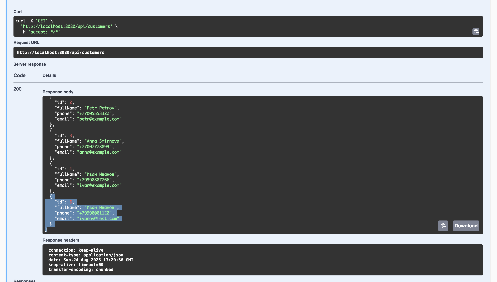

# AutoService Lite CRM

Mini-CRM for an auto service. REST API for managing customers and orders.
Built with **Java 17** and **Spring Boot 3**.

The project demonstrates clean architecture, DTO usage, Flyway migrations, global error handling, PostgreSQL integration, and Docker containerization.

---

## Table of Contents

* [Features](#features)
* [Architecture](#architecture)
* [Testing](#testing)
* [Tech Stack](#tech-stack)
* [Data Model](#data-model)
* [Database Migrations](#database-migrations)
* [Running](#running)

    * [Option A: Everything in Docker](#option-a-everything-in-docker)
    * [Option B: DB in Docker, app locally](#option-b-db-in-docker-app-locally)
* [REST API](#rest-api)

    * [Customers](#customers)
    * [Orders](#orders)
    * [cURL Examples](#curl-examples)
    * [Screenshots of Workflow](#screenshots-of-workflow)
* [Roadmap](#roadmap)

---

## Features

* CRUD for customers.
* CRUD for orders (linked to customers).
* Demo data automatically seeded via Flyway.
* Swagger UI for API testing.
* PostgreSQL with strict schema control.
* Global error handling and unified response format.
* Docker Compose for local startup (app + database).
* Basic unit and integration tests (repository, REST controller).

---

## Architecture

```
src/main/java/io/mitrofanovbp/autoservice/
 ├─ config/       # Configurations
 ├─ controller/   # REST controllers
 ├─ dto/          # DTOs for requests/responses
 ├─ exception/    # Custom exceptions + error handler
 ├─ model/        # JPA entities (Customer, Order)
 ├─ repository/   # Spring Data JPA repositories
 └─ service/      # Business logic
 
src/test/java/io/mitrofanovbp/autoservice/
 ├─ CustomerRepositoryTest.java   # Unit test for repository
 └─ CustomerControllerTest.java   # Integration test for REST API
```

---

## Testing

The project includes basic tests to demonstrate the testing approach:

* **Unit test for repository** (`CustomerRepositoryTest`)
  Verifies saving and retrieving a customer via JPA.

* **Integration test for controller** (`CustomerControllerTest`)
  Uses `MockMvc` to test customer creation and retrieving a list of customers via REST API.

Run tests:

```bash
mvn test
```

---

## Tech Stack

* **Java 17**
* **Spring Boot 3** (Web, Data JPA, Validation)
* **Hibernate** (via Spring Data JPA)
* **PostgreSQL 16**
* **Flyway** (DB migrations)
* **Jackson** (JSON serialization/deserialization)
* **Swagger (springdoc-openapi)** (REST API docs)
* **JUnit 5**, **Spring Test (MockMvc)** (testing)
* **Docker**, **Docker Compose**
* **Maven**

---

## Data Model

* `customers` — customers (`full_name`, `phone`, `email`)
* `orders` — orders (`description`, `status`, `customer_id`)

**Relation:** one customer → many orders.

---

## Database Migrations

* `V1__init.sql` — creates tables, relations, and constraints.
* `V2__seed_demo_data.sql` — demo data (a few customers and orders).

---

## Running

### Option A: Everything in Docker

```bash
docker compose up -d --build
docker compose logs -f app
```

* Swagger UI: `http://localhost:8080/swagger-ui.html`
* DB: `localhost:5433` (if port is mapped as 5433:5432)

### Option B: DB in Docker, app locally

1. Run DB only:

   ```bash
   docker compose up -d db
   ```
2. Configure environment variables in IDE/console:

   ```bash
   SPRING_DATASOURCE_URL=jdbc:postgresql://localhost:5433/autoservice_lite
   SPRING_DATASOURCE_USERNAME=postgres
   SPRING_DATASOURCE_PASSWORD=postgres
   ```
3. Run the app:

   ```bash
   mvn spring-boot:run
   ```

---

## REST API

Base path: `/api`

### Customers

* `GET /api/customers` — list customers
* `POST /api/customers` — create customer
* `GET /api/customers/{id}` — get customer by id
* `PUT /api/customers/{id}` — update customer
* `DELETE /api/customers/{id}` — delete customer

### Orders

* `GET /api/orders` — list orders
* `POST /api/orders` — create order (requires `customerId`)
* `GET /api/orders/{id}` — get order by id
* `PUT /api/orders/{id}` — update order
* `DELETE /api/orders/{id}` — delete order

---

### cURL Examples

```bash
# Create customer
curl -X POST http://localhost:8080/api/customers \
  -H "Content-Type: application/json" \
  -d '{"fullName":"Ivan Ivanov","phone":"+79998887766","email":"ivan@test.com"}'

# Get all customers
curl http://localhost:8080/api/customers

# Create order for customer (id=1)
curl -X POST http://localhost:8080/api/orders \
  -H "Content-Type: application/json" \
  -d '{"description":"Oil change","status":"NEW","customerId":1}'
```

---

## Screenshots of Workflow

### Create customer


### List customers



### Create order


### List orders


### Delete order


---

## Roadmap

* **Authentication and roles** (`ADMIN`, `MANAGER`).
* **Extended order model** (deadlines, status history).
* **Frontend UI** (React/Angular) for managers.
* **Customer notifications** (e-mail/Telegram).
* **CI/CD** (GitHub Actions).
* **Advanced logging** (levels `INFO/DEBUG/ERROR`, file output, request tracing).
